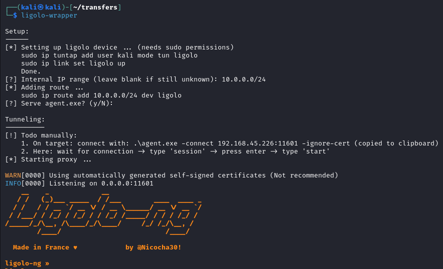
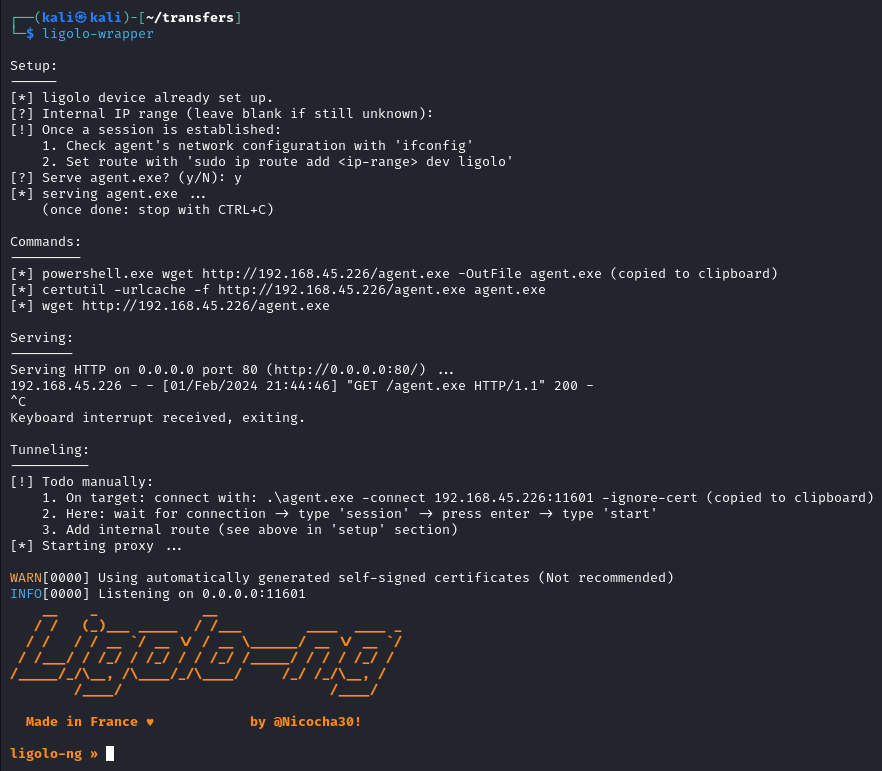
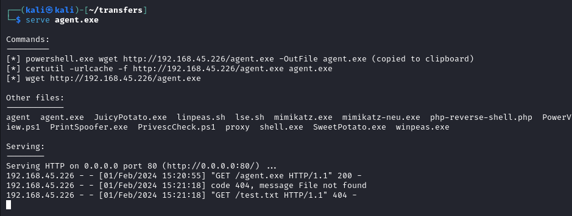
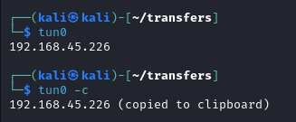
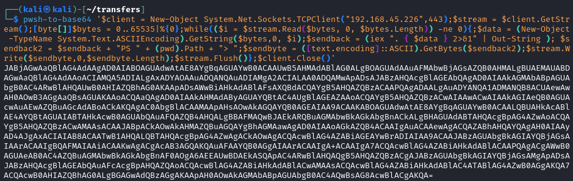
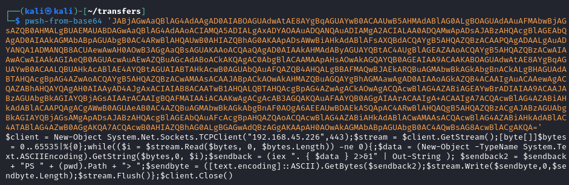

Useful scripts I'm using for OSCP preparation and CTF boxes.

**prerequisites:** `xclip` (`sudo apt install xclip`)

## content

- `ligolo-wrapper`
  - semi-automates the setup for tunneling with ligolo-ng
  - more on ligolo-ng: <https://github.com/nicocha30/ligolo-ng>
  - needs to be run in the same direcotory where ligolo proxy and agent are located 
- `serve`
  - for convenient serving of files via http
  - gets the tun0 IP, lists some useful download commands for copy/paste
  - lists the files that are served in the current working directory
  - `serve <filename>` includes the filename into the commands
- `tun0`
  - just echoes the IP address of the tun0 interface
  - `tun0 -c` additionally copies it to the clipboard for simple pasting
- `pwsh-[from|to]-base64`
  - makes use of `pwsh` to encode and decode powershell/windows conform base64

## install

`./install.sh` copies everything inside the scripts directory into `/usr/local/bin`.

## screenshots

